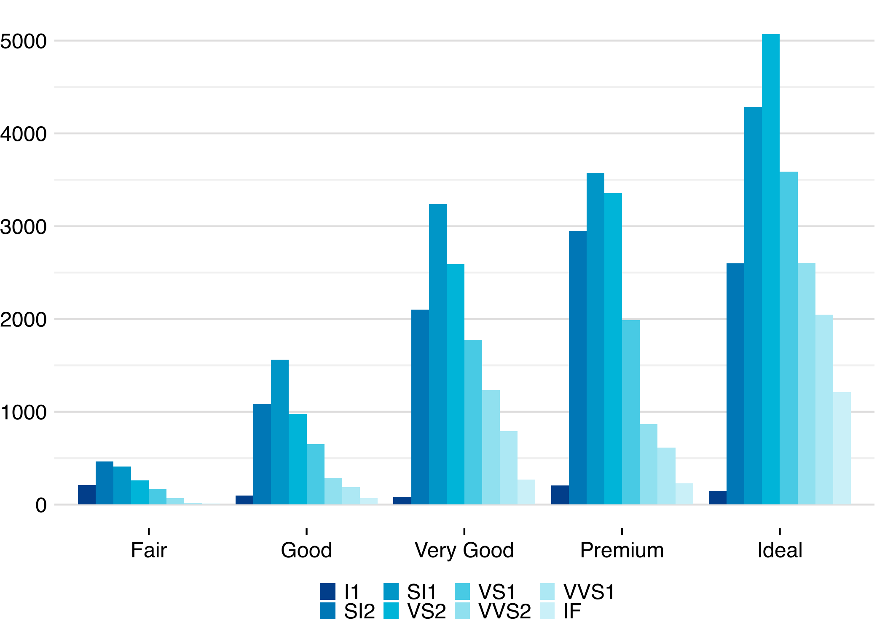

petgg
================

`petgg` é um tema para o pacote `ggplot2`

## Instalação

Primeiro instale o pacote `devtools`. Para usuários Windows é necessário
instalar o [RTools](https://cran.r-project.org/bin/windows/Rtools/)
antes.

``` r
# install.packages("devtools")
devtools::install_github("peteconomia/petgg")
```

## Uso

Sempre carrege o pacote depois de `ggplot2` ou `tidyverse`.

``` r
library(ggplot2)
library(petgg)
```

A função `petgg::set_theme()` aplica o tema.

``` r
petgg::set_theme()

ggplot(mpg) + 
    geom_point(aes(x = displ, y = hwy, color = class))
```

<!-- -->

Para voltar ao tema inicial use `petgg::reset()`

## Configurações

Por padrão o tema não mostra o nome dos eixos e título da legenda.
Espaço ao redor do gráfico foi removido para aumentar a visibilidade

### Tamanho da fonte

`base_size` argumento controla o tamanho da fonte em `pts`.

> `numeric`

> Padrão é `12`

``` r
petgg::set_theme(base_size = 22) # big !!!!

ggplot(mpg) + 
    geom_point(aes(x = displ, y = hwy, color = class))
```

<!-- -->

### Fontes

`base_family` é a família da fonte.

> `character`

> Padrão é `"EB Garamond"`

Para listar todas as fontes disponíveis que você pode utilizar:

``` r
names(pdfFonts())
```

    ##  [1] "serif"                         "sans"                         
    ##  [3] "mono"                          "AvantGarde"                   
    ##  [5] "Bookman"                       "Courier"                      
    ##  [7] "Helvetica"                     "Helvetica-Narrow"             
    ##  [9] "NewCenturySchoolbook"          "Palatino"                     
    ## [11] "Times"                         "URWGothic"                    
    ## [13] "URWBookman"                    "NimbusMon"                    
    ## [15] "NimbusSan"                     "URWHelvetica"                 
    ## [17] "NimbusSanCond"                 "CenturySch"                   
    ## [19] "URWPalladio"                   "NimbusRom"                    
    ## [21] "URWTimes"                      "ArialMT"                      
    ## [23] "Japan1"                        "Japan1HeiMin"                 
    ## [25] "Japan1GothicBBB"               "Japan1Ryumin"                 
    ## [27] "Korea1"                        "Korea1deb"                    
    ## [29] "CNS1"                          "GB1"                          
    ## [31] "EB Garamond"                   "EB Garamond ExtraBold"        
    ## [33] "EB Garamond Medium"            "EB Garamond SemiBold"         
    ## [35] "Fira Code"                     "Fira Code Light"              
    ## [37] "Fira Code Medium"              "Fira Code Retina"             
    ## [39] "Fira Mono"                     "Fira Mono Medium"             
    ## [41] "Fira Sans"                     "Fira Sans Book"               
    ## [43] "Fira Sans Eight"               "Fira Sans ExtraBold"          
    ## [45] "Fira Sans ExtraLight"          "Fira Sans Four"               
    ## [47] "Fira Sans Hair"                "Fira Sans Heavy"              
    ## [49] "Fira Sans Light"               "Fira Sans Medium"             
    ## [51] "Fira Sans SemiBold"            "Fira Sans Thin"               
    ## [53] "Fira Sans Two"                 "Fira Sans Ultra"              
    ## [55] "Fira Sans UltraLight"          "Font Awesome 5 Brands Regular"
    ## [57] "Font Awesome 5 Free Regular"   "Font Awesome 5 Free Solid"    
    ## [59] "Inconsolata"                   "JetBrains Mono"               
    ## [61] "JetBrains Mono ExtraBold"      "JetBrains Mono Medium"        
    ## [63] "Liberation Mono"               "Liberation Sans"              
    ## [65] "Liberation Serif"              "Open Sans"                    
    ## [67] "Open Sans ExtraBold"           "Open Sans Light"              
    ## [69] "Open Sans SemiBold"            "Open Sans Condensed Light"    
    ## [71] "Soleil"                        "Times New Roman"

``` r
petgg::set_theme(base_family = "Courier")

ggplot(diamonds) + 
    geom_bar(aes(x = cut, fill = clarity), position = "dodge") +
    labs(title = "Courier Fonte")
```

<!-- -->

`load_font` argumento carrega fontes pelo pacote `extrafont`. Padrão é
`TRUE`. Para importar fontes execute
`extrafont::font_import(prompt = FALSE)`

### Título dos eixos

`axis_title` argumento controla a visibilidade dos nomes dos eixos

> `logical`

> Padrão é `FALSE`

``` r
petgg::set_theme(axis_title = TRUE)

ggplot(diamonds, aes(depth, color = cut)) +
    geom_density()
```

<!-- -->

### Título da Legenda

`legend_title` argumento controla a visibilidade do título da legenda.

> `logical`

> Padrão é `FALSE`

``` r
petgg::set_theme(legend_title = TRUE)

ggplot(diamonds, aes(depth, color = cut)) +
    geom_density()
```

<!-- -->

### Posição da Legenda

`legend_position` argumento controla a posição da legenda no gráfico.

> `character` ou `numeric vector`

> Padrão é `"bottom"`. Pode ser `"top"`, `"right"`, `"bottom"`,
> `"left"`, `"none"` ou um par de coordenada, exemplo `c(0.9, 0.9)`

``` r
petgg::set_theme(legend_position = "right")

ggplot(economics_long, aes(date, value01, colour = variable)) + 
    geom_line()
```

<!-- -->

### Orientação da Legenda

`legend_direction` argumento controla a orientação da legenda.

> `character`

> Padrão é `"horizontal"`. Pode ser `"vertical"` ou `"horizontal"`

``` r
petgg::set_theme(legend_position = "right", legend_direction = "vertical")

ggplot(economics_long, aes(date, value01, colour = variable)) + 
    geom_line()
```

<!-- -->

## `theme_petgg()`

Para aplicar o tema para uma plotagem específica utilize
`petgg::theme_petgg()`. A função aceita os mesmos argumentos de
`petgg::set_theme()`

``` r
ggplot(mpg) + 
    geom_point(aes(x = displ, y = hwy, color = class)) +
    theme_petgg()
```

## `geom_bar` e `geom_col` `gap`

`gap` argumento controla o espaço entre as barras. É útil quando as
barras são colocada lado a lado (`position = "dodge"`) representando um
combinação de variáveis e é necessário ganhar espaço.

> character

Valores possíveis: `"s"` (pequeno), `"m"` (médio), `"b"` (grande)

``` r
petgg::set_theme()

ggplot(diamonds) + 
    geom_bar(aes(x = cut, fill = clarity), position = "dodge", gap = "s")
```

<!-- -->

## Configurações padrão

``` r
petgg::colors # acessa a paleta de cores padrão do tema
```

    ## [1] "#023E8A" "#0077B6" "#0096C7" "#00B4D8" "#48CAE4" "#90E0EF" "#ADE8F4"
    ## [8] "#CAF0F8"

``` r
petgg::alpha # transparência padrão do tema
```

    ## [1] 0.1
