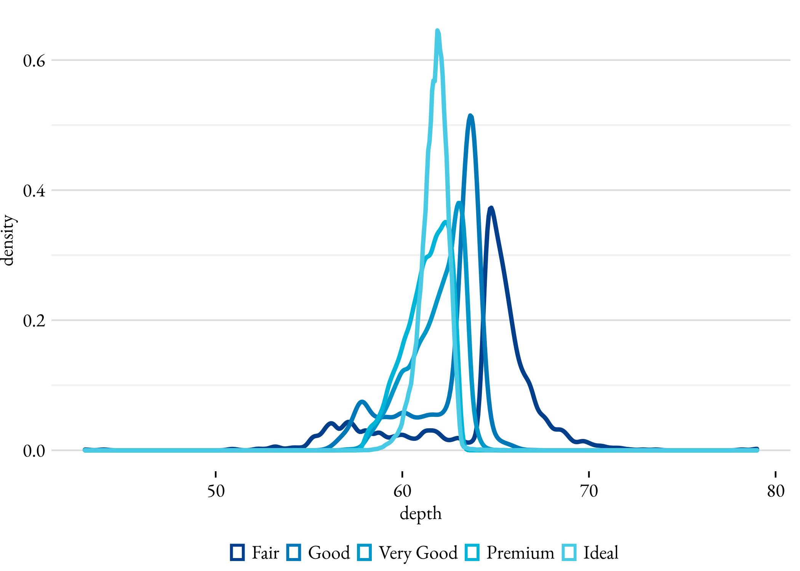
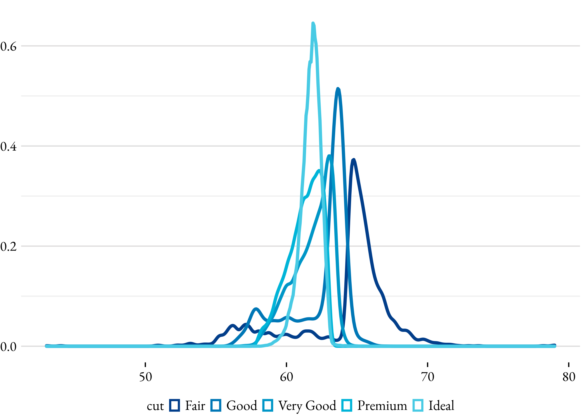
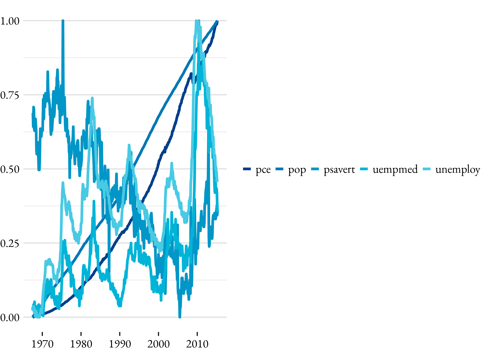

petgg
================

petgg é um tema para o pacote `ggplot2`

## Instalação

Primeiro instale o pacote `devtools`. Para usuários Windows é necessário
instalar o [RTools](https://cran.r-project.org/bin/windows/Rtools/)
antes.

``` r
install.packages("devtools")
devtools::install_github("peteconomia/petgg")
```

## Uso

Sempre carrege o pacote depois de `ggplot2` ou `tidyverse`.

``` r
library(ggplot2)
library(petgg)
```

    ## 
    ## Attaching package: 'petgg'

    ## The following objects are masked from 'package:ggplot2':
    ## 
    ##     geom_bar, geom_col, position_dodge, scale_color_discrete,
    ##     scale_colour_discrete, scale_colour_ordinal, scale_fill_discrete,
    ##     scale_fill_ordinal

A função `petgg::set_theme()` aplica o tema.

``` r
petgg::set_theme()

ggplot(mpg) + 
    geom_point(aes(x = displ, y = hwy, color = class))
```

<!-- --> Para voltar
ao tema inicial use `petgg::reset()`, não é um reset total, as cores não
são setadas para o tema padrão.

## Configurações

Por padrão o tema não mostra o nome dos eixos e título da legenda.
Espaço ao redor do gráfico foi removido para aumentar a visibilidade

### Tamanho da fonte

`base_size` argumento controla o tamanho da fonte em `pts`.

> `numeric`

> Padrão é `12`

``` r
petgg::set_theme(base_size = 22) # big !!!!

ggplot(mpg) + 
    geom_point(aes(x = displ, y = hwy, color = class))
```

<!-- -->

### Fontes

`base_family` é a família da fonte.

> `character`

> Padrão é `"Helvetica"`

Para listar todas as fontes disponíveis que você pode utilizar:

``` r
names(pdfFonts())
```

    ##  [1] "serif"                "sans"                 "mono"                
    ##  [4] "AvantGarde"           "Bookman"              "Courier"             
    ##  [7] "Helvetica"            "Helvetica-Narrow"     "NewCenturySchoolbook"
    ## [10] "Palatino"             "Times"                "URWGothic"           
    ## [13] "URWBookman"           "NimbusMon"            "NimbusSan"           
    ## [16] "URWHelvetica"         "NimbusSanCond"        "CenturySch"          
    ## [19] "URWPalladio"          "NimbusRom"            "URWTimes"            
    ## [22] "ArialMT"              "Japan1"               "Japan1HeiMin"        
    ## [25] "Japan1GothicBBB"      "Japan1Ryumin"         "Korea1"              
    ## [28] "Korea1deb"            "CNS1"                 "GB1"

``` r
petgg::set_theme(base_family = "Courier")

ggplot(diamonds) + 
    geom_bar(aes(x = cut, fill = clarity), position = "dodge") +
    labs(title = "Courier Fonte")
```

<!-- -->

### Título dos eixos

`axis_title` argumento controla a visibilidade dos nomes dos eixos

> `logical`

> Padrão é `FALSE`

``` r
petgg::set_theme(axis_title = TRUE)

ggplot(diamonds, aes(depth, color = cut)) +
    geom_density()
```

<!-- -->

### Título da Legenda

`legend_title` argumento controla a visibilidade do título da legenda.

> `logical`

> Padrão é `FALSE`

``` r
petgg::set_theme(legend_title = TRUE)

ggplot(diamonds, aes(depth, color = cut)) +
    geom_density()
```

<!-- -->

### Posição da Legenda

`legend_position` argumento controla a posição da legenda no gráfico.

> `character` ou `numeric vector`

> Padrão é `"bottom"`. Pode ser `"top"`, `"right"`, `"bottom"`,
> `"left"`, `"none"` ou um par de coordenada, exemplo `c(0.9, 0.9)`

``` r
petgg::set_theme(legend_position = "right")

ggplot(economics_long, aes(date, value01, colour = variable)) + 
    geom_line()
```

<!-- -->

### Orientação da Legenda

`legend_direction` argumento controla a orientação da legenda.

> `character`

> Padrão é `"horizontal"`. Pode ser `"vertical"` ou `"horizontal"`

``` r
petgg::set_theme(legend_position = "right", legend_direction = "vertical")

ggplot(economics_long, aes(date, value01, colour = variable)) + 
    geom_line()
```

<!-- -->

## `theme_petgg()`

Para aplicar o tema para uma plotagem específica utilize
`petgg::theme_petgg()`. A função aceita os mesmos argumentos de
`petgg::set_theme()`

``` r
ggplot(mpg) + 
    geom_point(aes(x = displ, y = hwy, color = class)) +
    theme_petgg()
```

## `geom_bar` e `geom_col` `gap`

`gap` argumento controla o espaço entre as barras. É útil quando as
barras são colocada lado a lado representando um combinação de varáveis.

> character

Valores possíveis: `"s"` (pequeno), `"m"` (médio), `"b"` (grande)

``` r
petgg::set_theme()

ggplot(diamonds) + 
    geom_bar(aes(x = cut, fill = clarity), position = "dodge", gap = "s")
```

<!-- -->

## Cores

``` r
petgg::colors # paleta de cores
```

    ## [1] "#023E8A" "#0077B6" "#0096C7" "#00B4D8" "#48CAE4" "#90E0EF" "#ADE8F4"
    ## [8] "#CAF0F8"

``` r
petgg::alpha # transparência
```

    ## [1] 0.1
