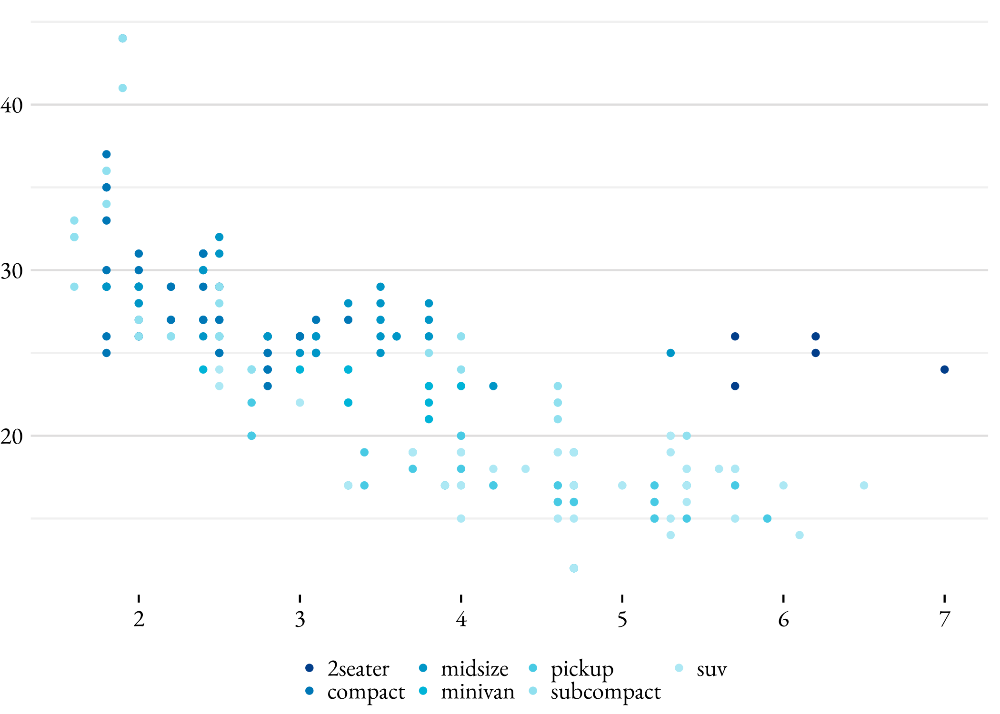
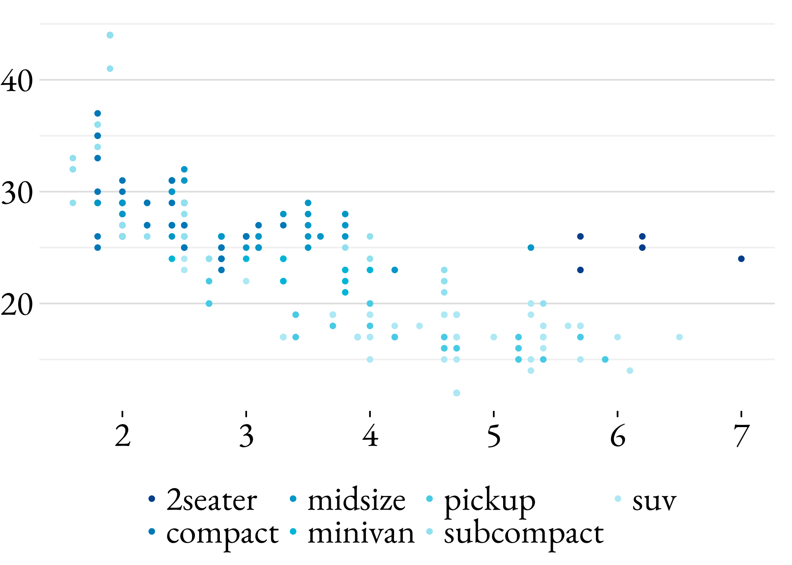
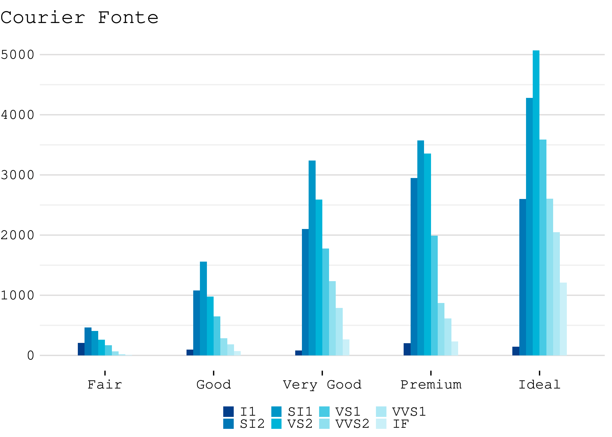
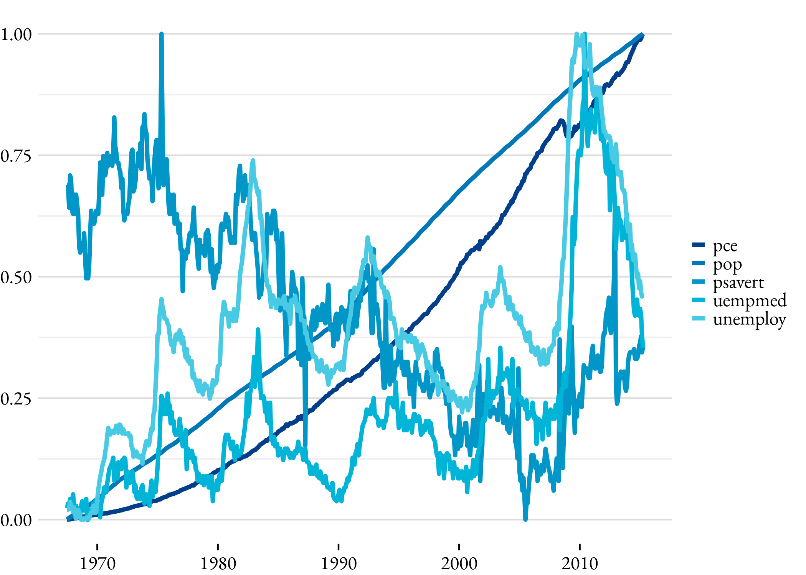
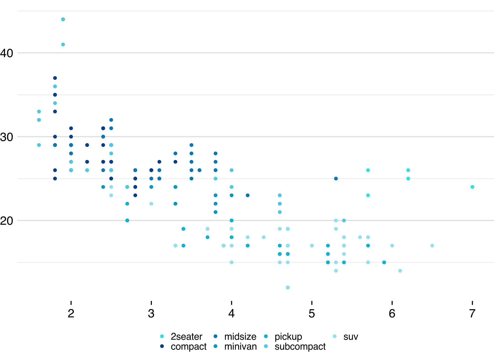

petgg \| `ggplot2` tema
================

petgg é um tema para o pacote `ggplot2`

## Instalação

``` r
install.packages("devtools")
devtools::install_github("peteconomia/petgg")
```

Requisitos:

-   Windows: instalar
    [Rtools](https://cran.r-project.org/bin/windows/Rtools/)

-   Ubuntu:
    `sudo apt install build-essential libcurl4-gnutls-dev libxml2-dev libssl-dev`

## Uso

Sempre carrege o pacote depois de `ggplot2` ou `tidyverse`.

``` r
library(ggplot2)
library(petgg)
```

    ## 
    ## Attaching package: 'petgg'

    ## The following objects are masked from 'package:ggplot2':
    ## 
    ##     geom_bar, geom_col, position_dodge, scale_color_discrete,
    ##     scale_colour_discrete, scale_colour_ordinal, scale_fill_discrete,
    ##     scale_fill_ordinal

A função `petgg::set_theme()` aplica o tema. Para voltar ao tema inicial
`petgg::reset()`

> `petgg::reset()` não é um reset total, as cores não são setadas para o
> padrão

``` r
petgg::set_theme()

ggplot(data = mpg) + 
    geom_point(mapping = aes(x = displ, y = hwy, color = class))
```

<!-- -->

## Configurações

Por padrão `petgg` não mostra o nome dos eixos e título da legenda.
Espaço ao redor do gráfico foi removido para aumentar a visibilidade

### Tamanho da fonte

`base_size` argumento controla o tamanho da fonte em `pts`.

> `numeric`

> O tamanho padrão é `12`

``` r
petgg::set_theme(base_size = 22) # big !!!!

ggplot(data = mpg) + 
    geom_point(mapping = aes(x = displ, y = hwy, color = class))
```

<!-- -->

> O tamanho da legenda é relativo a `base_size`

### Fontes

`base_family` é a família da fonte.

> `character`

> A fonte padrão é `Helvetica`

Para listar todas as fontes disponíveis que você pode utilizar:

``` r
names(pdfFonts())
```

    ##  [1] "serif"                "sans"                 "mono"                
    ##  [4] "AvantGarde"           "Bookman"              "Courier"             
    ##  [7] "Helvetica"            "Helvetica-Narrow"     "NewCenturySchoolbook"
    ## [10] "Palatino"             "Times"                "URWGothic"           
    ## [13] "URWBookman"           "NimbusMon"            "NimbusSan"           
    ## [16] "URWHelvetica"         "NimbusSanCond"        "CenturySch"          
    ## [19] "URWPalladio"          "NimbusRom"            "URWTimes"            
    ## [22] "ArialMT"              "Japan1"               "Japan1HeiMin"        
    ## [25] "Japan1GothicBBB"      "Japan1Ryumin"         "Korea1"              
    ## [28] "Korea1deb"            "CNS1"                 "GB1"

``` r
petgg::set_theme(base_family = "Courier")

ggplot(data = diamonds) + 
    geom_bar(mapping = aes(x = cut, fill = clarity), position = "dodge") +
    labs(title = "Courier Fonte")
```

<!-- -->

### Título dos eixos

`axis_title` argumento controla a visibilidade dos nomes dos eixos

> `logical`

> O padrão é `FALSE`

``` r
petgg::set_theme(axis_title = TRUE)

ggplot(diamonds, aes(depth, color = cut)) +
    geom_density(alpha = 0.5)
```

<!-- -->

### Título da Legenda

`legend_title` argumento controla a visibilidade do título da legenda.

> `logical`

> O padrão é `FALSE`

``` r
petgg::set_theme(legend_title = TRUE)

ggplot(diamonds, aes(depth, color = cut)) +
    geom_density(alpha = 0.5)
```

<!-- -->

### Posição da Legenda

`legend_position` argumento controla a posição da legenda no gráfico.

> `character` ou `numeric vector`

> O padrão é `bottom`. Pode ser `top`, `right`, `bottom`, `left`, `none`
> ou um par de coordenada, exemplo `c(0.9, 0.9)`

``` r
petgg::set_theme(legend_position = "right")

ggplot(diamonds, aes(price, colour = cut)) +
    geom_freqpoly(binwidth = 500)
```

<!-- -->

### Orientaçao da Legenda

`legend_direction` argumento controla a orientação da legenda.

> `character`

> O padrão é `horizontal`. Pode ser `vertical` ou `horizontal`

``` r
petgg::set_theme(legend_position = "right", legend_direction = "vertical")

ggplot(diamonds, aes(price, colour = cut)) +
    geom_freqpoly(binwidth = 500)
```

<!-- -->

## `theme_petgg()`

Para aplicar o tema para uma plotagem específica utilize
`petgg::theme_petgg()`. A função aceita os mesmos argumentos de
`petgg::set_theme()`

``` r
petgg::reset() # aplicando reset

ggplot(data = mpg) + 
    geom_point(mapping = aes(x = displ, y = hwy, color = class)) +
    theme_petgg()
```

<!-- -->
